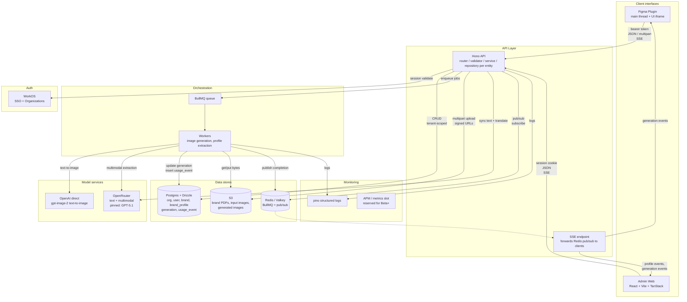

# Architecture

End-to-end technical architecture for the platform. Anchors all the other documents in this repository.

## How this architecture balances the four assessment criteria

| Criterion | How the architecture answers it |
|-----------|---------------------------------|
| **User experience & performance** | Two latency classes: synchronous text operations (copy variants, translation) hit a single LLM round-trip and stay inside the ≤2s budget; image generation is async via BullMQ with SSE notifications, so the plugin never blocks. Admin web is a standard React SPA with TanStack Query for snappy navigation. |
| **Development effort (2 engineers + AI coding agents, 8-week target inside a 10-week ceiling)** | Managed services everywhere — WorkOS for auth and RBAC, OpenRouter as the text/multimodal gateway, OpenAI direct for image gen at MVP, PostHog as the single observability platform (errors, alerts, session replay, feature flags, product analytics, LLM tracing, LLM evals), S3, Postgres, Redis. A single TypeScript stack across web / API / worker via a Turborepo monorepo with shared Zod schemas. No bespoke infrastructure to operate. |
| **Short-term impact (Weeks 0–3, MVP)** | Internal pilot for the 10-person Creative Studio at DesignTechCo. Four user-facing actions wired end to end: generate copy variants, translate across 8 locales, generate text-to-image variants, apply selected variant inside Figma (image-to-image lands in Beta). Single tenant. WorkOS SSO. WorkOS User Management widget for in-app team admin. The 3-day localisation collapses to under 5 minutes. |
| **Long-term impact (Weeks 3–8, Beta + Final Rollout)** | Multi-tenant SaaS at week 8. `org_id` on every table from day one; RBAC enforced via WorkOS roles (`admin` / `brand_manager` / `designer`) plus `user_brand` access mapping in our Postgres; PostHog full observability + LLM evals per feature; analytics scaling decision committed at Final Rollout based on Beta metrics (skip rollups / build rollups / ClickHouse migration); public plugin live in the Figma Community. No Phase 3 backlog. |

## Component diagram

`-->` denotes synchronous calls; `-.->` denotes pub/sub. Auth (WorkOS) sits outside the request path for steady-state traffic — it's only consulted on session validation. Monitoring is shown as a slot; pilot ships logs, full APM lands in Beta.

## Components

### 1. Client interface — Figma plugin

The primary surface for designers. Two-thread architecture: a sandboxed main thread that reads and writes Figma layers via the `figma` global, and a UI iframe with full browser APIs (fetch, EventSource, DOM). The two communicate via `postMessage`. Auth tokens live in `figma.clientStorage` and travel as bearer tokens on every API call. Image fills are applied via `figma.createImageAsync(signedUrl)` after the user picks a variant.

The plugin design pass is deferred per scope. Backend contract details that affect the plugin are captured in `research/figma-plugin.md` and the relevant feature designs.

### 2. Client interface — Admin web

React + Vite + TanStack Router/Query/Form, styled with Tailwind 4 and shadcn/ui components. Hosts:

- Brand management (`brand`)
- Brand-guideline lifecycle (`brand-profile`, with PDF upload, structured profile editor, version history, rollback)
- Generations history (`generation`, with detail drawer + SSE for live updates)
- Usage dashboard (`usage`, daily cost chart + per-user table)
- Auth flows (sign-in / sign-out via WorkOS hosted UI)

Cookie-based session (WorkOS sealed session, httpOnly + Secure + SameSite=Lax) — the plugin's bearer-token model isn't used here.

### 3. API layer — Hono

Single Node + TypeScript service. Per-entity folder: `router.ts` / `validator.ts` / `service.ts` / `repository.ts` / `types.ts`. Repositories return `Result<T, E>` (hand-rolled, see `engineering.md`). Routers always unwrap to HTTP. No try/catch outside the repository and worker layers.

Hosts:

- All synchronous request paths (auth callback, brand/profile/generation CRUD, sync text generation, sync translation)
- The SSE endpoint that forwards Redis pub/sub events to subscribed clients

Image generation, brand-guideline extraction, and any other long-running model call are dispatched into BullMQ rather than handled in the API process.

### 4. Orchestration — BullMQ workers

Background workers run inside `apps/worker`. They consume BullMQ jobs over Redis, call the relevant model service, persist results to Postgres + S3, and publish completion events to a Redis pub/sub channel that the API's SSE endpoint subscribes to.

Job types in MVP:

- `image-generate` — **text-to-image only at MVP**; calls OpenAI `gpt-image-2` directly, downloads variants, uploads to S3. Image-to-image (edit) lands in Beta via fal.ai (OpenAI's native `images.edit` does not currently accept `gpt-image-2`).
- `brand-profile-extract` — multimodal GPT-5.1 via OpenRouter reads a PDF and emits a `BrandProfile` JSON

BullMQ retry config per job: 3 attempts, exponential backoff, base 1000ms. After exhaustion, the corresponding `generation` or `brand_profile` row transitions to `failed` and a failure event is emitted on SSE.

### 5. Model services — external

Pure API dependencies. No self-hosted models, no inference infrastructure to operate.

**MVP — OpenRouter for text/multimodal, OpenAI direct for image.**

| Surface | Endpoint | Model (MVP) | Notes |
|---------|----------|-------------|-------|
| Sync text + translation | OpenRouter | GPT-5.1 (pinned, env-config) | OpenRouter as a single gateway from day one. Hardcoded to GPT-5.1; flips to GPT-5.4 with one env var if 5.1 deprecated upstream. ~5% gateway markup is bought outright by skipping the multi-provider integration work later. |
| PDF extraction (worker) | OpenRouter | GPT-5.1 multimodal | Same gateway as text. |
| Image generation (worker) | OpenAI direct | `gpt-image-2` | **Text-to-image only at MVP.** OpenAI's `images.edit` endpoint does not currently accept `gpt-image-2` — image-to-image lands in Beta via fal.ai. |

All call sites go through `packages/ai`, which wraps the Vercel AI SDK. The wrappers expose typed `generateObject` / `generateImage` calls and centralize prompt assembly. Provider selection is one config flip away. Same-provider retry-with-backoff on transient errors at every surface.

**Beta — fal.ai for image-to-image + image fallback; per-feature routing for text.**

| Surface | Beta addition | Why |
|---------|---------------|-----|
| Image-to-image | fal.ai (`gpt-image-2/edit`) | Beta unlocks the image-edit path that OpenAI's native endpoint blocks for `gpt-image-2`. |
| Image fallback | fal.ai (Flux family) | Cross-provider fallback if OpenAI image throttles. Same call site. |
| Text per-feature picks | OpenRouter routing rules | Eval data from MVP informs which features benefit from a different model (e.g. translation → Claude if eval shows better tone preservation). Same call site. |

Routing rules controlled via PostHog feature flags. Beta lighting up multi-provider is a config change, not a rewrite — `packages/ai` already abstracts the call site.

### 6. Data stores

| Store | What it holds |
|-------|---------------|
| **Postgres + Drizzle** | Source of truth for operational data — `org`, `user`, `user_brand` (RBAC scope), `brand`, `brand_profile` (versioned, profile in `jsonb`), `generation` (input/output in `jsonb`), `usage_event` (atomic billing rows). Every table has `org_id` indexed for tenant scoping. Analytics-read pattern (direct queries, daily rollups, or ClickHouse mirror) is decided at Final Rollout — see "Analytics scaling decision" below. |
| **S3** | Brand-guideline source PDFs, generated image variants (and uploaded image-to-image inputs once Beta lights up that path). Forever retention. Access via short-lived signed URLs (1h for client reads). |
| **Redis (or Valkey)** | BullMQ backing store; pub/sub channel that bridges workers to the SSE endpoint. No user data. |

**Analytics scaling decision (gated on Beta metrics, committed in Final Rollout).** We do not pre-commit to a rollup pipeline or a warehouse migration. At week 6 we audit Beta numbers and pick a branch:

| Beta number | Branch | What ships |
|-------------|--------|-----------|
| Volume < 50k events/day, p95 < 200ms on raw | **Skip rollups.** | Direct Postgres queries continue. Revisit at month 3 post-launch. |
| Volume 50k–500k/day, p95 200ms–1s | **Build rollups.** | Daily aggregate table per `(org_id, user_id, brand_id, feature, date)` refreshed nightly. Dashboard reads aggregates for trends, drops to raw `usage_event` for drill-downs. Implementation specifics deferred until the audit picks this branch. |
| Volume > 500k/day sustained, or p95 > 1s on rollups, or customer-facing analytics enters scope | **Migrate to ClickHouse.** | `usage_event` mirrored via PostHog batch export or direct CDC. Postgres remains OLTP source of truth. The 2-week buffer to the 10-week ceiling exists for this branch. |

Telemetry (error traces, LLM call traces, eval results, product analytics) lives in PostHog regardless of which branch ships. The decision above only governs `usage_event` analytics on our Postgres source of truth.

### 7. Auth + RBAC

Delegated to WorkOS:

- WorkOS **Organizations** primitive maps 1:1 to our `org` table — multi-tenant from day one.
- WorkOS hosted SSO endpoint fans out to any OIDC/SAML IdP (Google Workspace, Okta, Azure AD).
- JIT user provisioning on first sign-in.
- Two session styles supported by the same auth middleware:
  - **Cookie session** for the admin web (httpOnly, Secure, SameSite=Lax)
  - **Bearer token** for the Figma plugin (held in `figma.clientStorage`)
- **RBAC** ships in Beta (Phase 2). Three roles: `admin`, `brand_manager`, `designer`. Roles live on `user.role`, mirrored from WorkOS. Per-user brand access via `user_brand` mapping — designers see only the brands they're assigned to. Every router scope-checks `(org_id, user_id, role, brand_id)` before any read or write.
- The role boundary protects the brand surface. Admins manage roles and onboarding; brand managers own the brand-profile lifecycle; designers consume profiles through generation actions but cannot edit them.

Designed in `designs/auth-sso.md`.

### 8. Observability + evals

PostHog is the single observability platform. One vendor across error tracking, alerts, session replay, feature flags, product analytics, LLM tracing, and LLM evaluation. Lands in Phase 2 (Beta). The same package serves both engineering and brand managers.

| Surface | What PostHog provides |
|---------|------------------------|
| Errors + alerts | Captured exceptions from API and workers. Issue grouping, release tagging, Slack/email alert routing. Replaces Sentry-class error monitoring at our scale. |
| Session replay | Admin web replays for bug repro and customer-success sessions. Tied to `userId` + `orgId`. |
| Feature flags | Staged rollouts (RBAC enforcement, brand-profile schema migrations, plugin batch-mode). Per-tenant overrides. |
| Product analytics | Funnels (sign-in → first generation → applied variant). Retention curves per role. Supplements `usage_event` with UI-event context. |
| LLM observability | Trace per model call: prompt, brand-profile context, tokens, output, latency, cost. Routed by `(org_id, brand_id, generation_id)`. Replaces a separate LangSmith / OpenTelemetry-LLM integration. |
| LLM evals | Eval set per brand. LLM-as-judge for tone match against the brand profile. Code-based check for brand-color presence in image output. Runs nightly. Regressions block `is_current=true` flips and surface in the admin web. |

`pino` structured JSON logs still ship at API + worker entrypoints (`requestId`, `userId`, `orgId` per request). They feed PostHog through the OTLP log exporter; long-term retention is on PostHog's logs surface. `pino-pretty` only in local dev.

Cost and usage observability remains in the application data model: every model call writes a `usage_event` row scoped by `org_id`. Dashboard read pattern is decided at Final Rollout per the analytics scaling audit (skip / aggregates / ClickHouse). At MVP scale (Branch A, direct queries) the dashboard runs sub-100ms p95; the audit upgrades the read path only if Beta volume demands it. PostHog supplements with UI-event analytics for funnels and retention.

Health and availability (99% target): managed-service SLAs as the floor, PostHog uptime checks for the API, alert thresholds tuned during Beta.

## External dependencies summary

| Vendor | Service | Failure mode |
|--------|---------|--------------|
| OpenRouter | Sync text, translation, PDF extraction (GPT-5.1 pinned at MVP) | Single gateway, single key. MVP: same-provider retries. Beta: per-feature model picks via routing rules. ~5% gateway markup. |
| OpenAI direct | `gpt-image-2` text-to-image at MVP | MVP: job goes to `failed` after retries, user retries manually. Beta: cross-provider fallback to fal.ai. |
| fal.ai | Image-to-image (Beta), image fallback (Beta) | Beta unlocks the `gpt-image-2/edit` path that OpenAI's native endpoint blocks for `gpt-image-2`, plus Flux fallback. |
| WorkOS | SSO + Organizations + Roles + User Management widget | Sign-in fails; existing sessions remain valid until expiry. Role lookup is cached locally. |
| PostHog | Errors, alerts, session replay, flags, product analytics, LLM observability, LLM evals | Telemetry buffered locally; missing data is non-fatal. Eval-blocked publishes fall back to manual brand-manager override on outage. |
| Figma | Plugin Community listing + REST API + OAuth app review | Public listing requires Figma review (5–10 business days target). Private install per org is the bridge during review. |
| AWS S3 | Object store | Image fetch / upload errors propagate up the stack; would warrant CDN / region failover only at scale |

## Multi-tenant readiness

Every architectural decision either supports or doesn't block the multi-tenant SaaS phase.

| Concern | MVP shape | What changes for SaaS |
|---------|-----------|------------------------|
| Tenant identity | `org` ↔ WorkOS Organization (1:1), pilot has one row | New customers self-onboard via WorkOS hosted sign-up; one new `org` row per customer |
| Data isolation | `org_id` on every table; partial unique indexes scoped by `org_id`; query layer always scopes by request-context `orgId` | No change |
| Authn / authz | One auth middleware, two session styles | Existing — WorkOS already supports multi-org natively |
| Per-tenant infrastructure | None — single Postgres, single Redis, single S3 bucket with `<orgId>/` prefixes, single API & worker fleet | Still none. Vertical scale, then read replicas |
| Per-tenant cost attribution | `usage_event` carries `org_id` on every row | No change. Add per-org billing surface in the SaaS phase |
| Per-tenant resource isolation | Application-level rate-limit guardrails (deferred in MVP) | Add per-tenant rate limits and spend caps. Same data model. |
| Custom domains / branding | Not modelled in MVP | Adds a `tenant_domain` table; auth middleware resolves tenant by domain. Doesn't move the rest of the architecture. |

## How the pieces fit together — quick orientation

- A designer in Figma triggers an action → the plugin sends a JSON or multipart request to the API with their bearer token.
- The API authenticates via WorkOS, scopes to the user's `org_id`, validates with a Zod schema, and either:
  - **Synchronous path** (text gen, translate, brand CRUD, profile read): runs the work and returns the response.
  - **Asynchronous path** (image gen, profile extraction): enqueues a BullMQ job, persists a `pending` row, returns a job id, and the client subscribes to the SSE endpoint.
- Workers do the model calls, write outputs to S3 and Postgres, publish completion events.
- The API's SSE endpoint forwards those events to the subscribed plugin or admin web tab.
- Generations and usage are visible from the admin web (history, dashboard) — both pages read directly from `generation` + `usage_event`.
- Brand guidelines flow in via PDF upload from the admin web; structured `BrandProfile`s ground every prompt the platform sends to a model.

A full end-to-end "localise copy + replace images" walkthrough lives in `data-flow.md`.

## What's deliberately not on this diagram

- A separate "BFF" between the plugin and the core API — Hono serves both clients directly. Their differences (bearer vs cookie, multipart vs JSON) are handled in middleware and route shape.
- A CDN in front of S3 — straightforward to add when image-fetch volume grows; the manifest already accommodates a wildcard domain.
- A streaming text path (server-sent partial tokens) — text gen fits the 2s budget without it; revisit if UX wants typewriter effects.
- **Multi-provider routing logic at MVP.** The plumbing (OpenRouter for text, `packages/ai` abstraction over both gateways) is in from day one, but MVP pins to one model per surface. Beta turns on per-feature picks (text via OpenRouter routing rules) and adds fal.ai as the image fallback + image-to-image surface.
- A separate identity/profile service — WorkOS owns identity; we own only the local mirror.
- A separate APM (Datadog, New Relic, Grafana Cloud) — PostHog covers errors, alerts, session replay, product analytics, LLM tracing, and evals. One vendor, one billing surface, one SDK.
- **A columnar warehouse (ClickHouse or equivalent) at MVP and Beta** — Postgres handles `usage_event` volumes through Beta. The decision is *not deferred indefinitely* — it is a scheduled audit at Final Rollout (week 6) gated on actual Beta numbers. Three branches: skip rollups, build rollups, or migrate to ClickHouse. Telemetry, traces, and evals live in PostHog regardless of which branch ships.
- **Per-tenant rate limits** — single-tenant in MVP, light multi-tenant in Beta. Same-provider retries plus single-OpenAI-key concurrency are sufficient until customer usage demands tighter caps. Adding caps is a config change in the LLM proxy.

These are deferred or rejected on purpose, not oversights.

## Related documents

- `tooling.md` — locked stack and rationale per choice
- `engineering.md` — coding conventions, monorepo layout, Result pattern
- `data-model.md` — Postgres schema, indexes, ER diagram
- `research/figma-plugin.md` — plugin runtime constraints that shaped the API
- `designs/*` — per-feature designs (auth, brand, brand-profile, generations, text generation, image generation, usage dashboard)
- `data-flow.md` (next) — end-to-end "localise copy + replace images" walkthrough
- `roadmap.md` (next) — MVP / Beta / Full roll-out + risks
