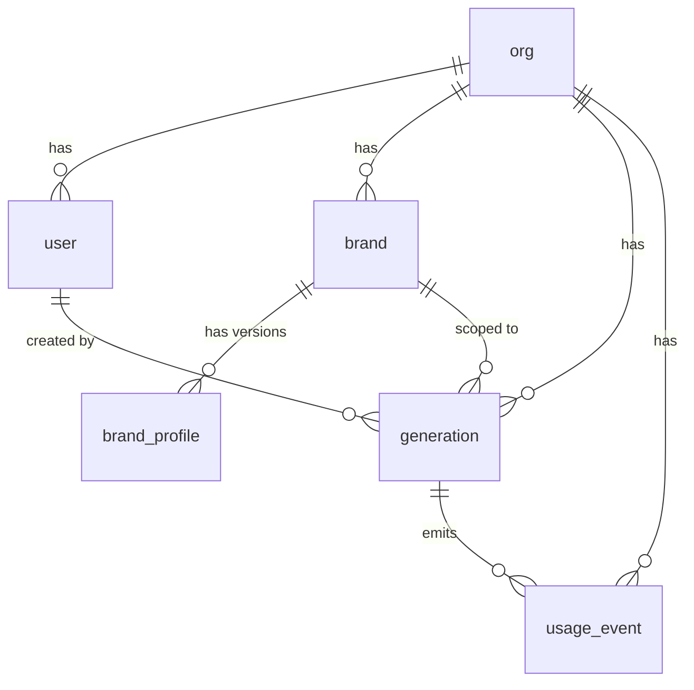
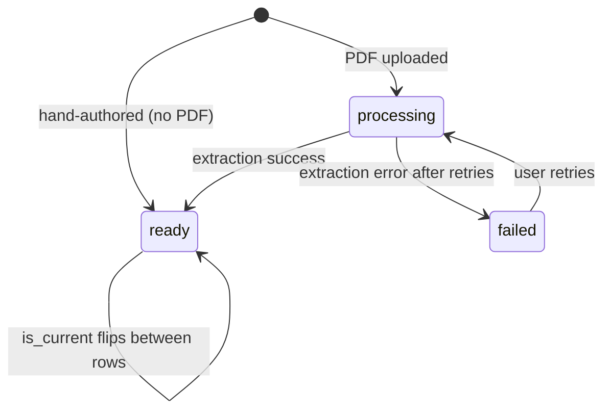

# Data Model

Six core tables. Postgres. Every table has `org_id` indexed for tenant scoping. The whole `BrandProfile` lives inside a single `jsonb` column on `brand_profile`.

## Entity overview



`org_id` is on every table even when not shown above. All relationships are scoped within an org.

## Tables

### `org`

Tenant root. Mirrors a WorkOS Organization.

| Field | Notes |
|-------|-------|
| `id` (uuid pk) | |
| `name` | |
| `workos_org_id` | unique; links to WorkOS |
| `created_at` | |

### `user`

Authenticated identity within an org. Provisioned just-in-time on first SSO sign-in.

| Field | Notes |
|-------|-------|
| `id` (uuid pk) | |
| `org_id` | indexed, fk → `org` |
| `workos_user_id` | unique |
| `email`, `name` | |
| `role` | text enum: `'admin'` / `'brand_manager'` / `'designer'`. Default `'designer'`. Mirrored from WorkOS Roles. Attached to request context at MVP but not gated; gate fires from Beta onwards (see `designs/auth-sso.md`). |
| `created_at` | |

### `brand`

Brand owned by an org. The unit users switch context to and the scope for guidelines and generations. Soft-deleted via `deleted_at` so historical `generation` rows that reference `brand_id` remain readable.

| Field | Notes |
|-------|-------|
| `id` (uuid pk) | |
| `org_id` | indexed |
| `name` | |
| `deleted_at` | timestamptz, nullable. Null = present; set = removed (UI label "Remove"). No restore. |
| `created_at` | |

### `brand_profile`

Versioned, structured profile of a brand's voice and visual identity, extracted from a PDF or hand-authored. The whole structured profile is stored as a single `jsonb` column. Rows are immutable except for the `is_current` flag, which is flipped when rolling back to a previous version.

The full lifecycle of this table is described in `designs/brand-guideline-management.md`. Summary:

| Field | Notes |
|-------|-------|
| `id` (uuid pk) | |
| `org_id` | indexed |
| `brand_id` | indexed |
| `version` | int, monotonic per brand |
| `profile` (jsonb) | nullable while `status` is `processing` or `failed` |
| `source_pdf_s3_key` | nullable; copied forward from the prior version on manual-edit rows |
| `source_pdf_filename`, `source_pdf_size_bytes` | nullable |
| `status` | enum: `processing` / `ready` / `failed` |
| `ingest_error` | nullable |
| `is_current` | bool; partial unique index ensures exactly one `true` per brand, only on `ready` rows |
| `created_by` | fk → `user` |
| `created_at` | |

State machine:



### `user_brand` (Beta scope)

Per-user × per-brand access mapping. Drives the fine axis of RBAC (designers see only the brands they're assigned to). Admins and brand_managers bypass on read; row-level join applies only when `role = 'designer'`. Ships in Beta — table exists in MVP for forward compatibility but no gate fires.

| Field | Notes |
|-------|-------|
| `user_id` (uuid fk → `user`) | composite pk |
| `brand_id` (uuid fk → `brand`) | composite pk |
| `granted_at` | timestamptz, default `now()` |
| `granted_by` (uuid fk → `user`) | who assigned it; for audit |

Composite primary key `(user_id, brand_id)`. Indexed on `brand_id` for "who has access" lookups in the admin UI.

### `generation`

One row per user-initiated generation request (copy variant, translation, image). Holds input, output, status, and timestamps. Doubles as the audit log for all model output.

| Field | Notes |
|-------|-------|
| `id` (uuid pk) | |
| `org_id`, `brand_id`, `user_id` | indexed |
| `type` | enum: `copy_variant` / `translate` / `image` |
| `status` | enum: `pending` / `running` / `done` / `failed` |
| `input` (jsonb) | source text, target locale, prompt, layer hints |
| `output` (jsonb) | nullable; array of variants when `done` |
| `error` | nullable |
| `figma_file_key` | text, nullable. Set for plugin-originating generations. Used for traceability and the per-node lock on image generations. |
| `figma_node_id` | text, nullable. Set for image generations (single-node target). Participates in the per-node lock. |
| `started_at`, `completed_at`, `created_at` | |

### `usage_event`

Atomic billing unit. One row per LLM API call. A single `generation` may emit several `usage_event`s — for example, a copy-variant generation that uses an extraction call plus a generation call would produce two rows.

| Field | Notes |
|-------|-------|
| `id` (uuid pk) | |
| `org_id`, `brand_id`, `user_id`, `generation_id` | indexed |
| `feature` | enum: `copy_variant` / `translate` / `image` / `extract` |
| `provider` | text: `openai` |
| `model` | text: `gpt-5.1` / `gpt-image-2` |
| `input_tokens`, `output_tokens` | nullable for image / extract calls |
| `cost_usd` | numeric, computed at write |
| `latency_ms` | |
| `created_at` | |

## Indexes

```sql
-- tenant scope on every table
create index on "user" (org_id);
create index on brand (org_id);
create index on brand_profile (org_id);
create index on generation (org_id);
create index on usage_event (org_id);

-- access patterns
create index on brand_profile (org_id, brand_id, version desc);
create unique index on brand_profile (brand_id) where is_current = true;
create index on brand_profile (org_id, status) where status in ('processing','failed');

create index on generation (org_id, user_id, created_at desc);
create index on generation (org_id, status) where status in ('pending','running');

-- per-node lock for image generations
create unique index on generation (org_id, figma_file_key, figma_node_id)
  where type = 'image' and status in ('pending','running');

create index on usage_event (org_id, created_at desc);
create index on usage_event (org_id, user_id, created_at desc);
create index on usage_event (org_id, brand_id, created_at desc);
```

## Open items

- Locale list — locked to 8 ISO codes (`en, es, fr, de, it, pt-BR, ja, zh`) in `designs/text-layer-generation.md`
- Spend caps and rate-limit enforcement — deferred (out of MVP scope)
- Multi-PDF aggregation per brand — deferred; one PDF per profile version is the current rule
