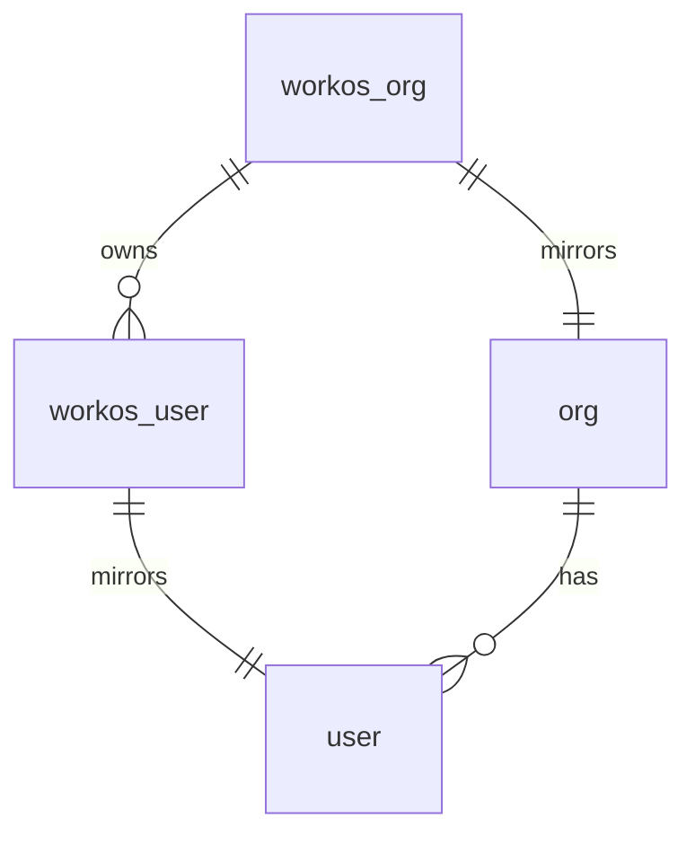

# Auth / SSO Design

How users authenticate into the platform and how every backend request is scoped to a tenant.

## Goals

- SSO via the customer's existing IdP (Google Workspace, Okta, Azure AD, etc.).
- Multi-tenant from day one — every request carries an authenticated `(user_id, org_id)` context.
- Just-in-time user provisioning so admins don't pre-create users.
- No DIY identity code. Identity is delegated to WorkOS.

## Provider: WorkOS

WorkOS gives us:

- A single SSO endpoint that fans out to any OIDC/SAML IdP.
- An Organizations primitive that maps directly onto our `org` table.
- Hosted authentication UI we can use as-is for MVP.
- Server-side session validation primitives.

This means our backend is responsible for only two things: redirecting to WorkOS at sign-in, and verifying sessions on every subsequent request.

## Identity model



Each WorkOS Organization corresponds 1:1 to an `org` row in our database. Each WorkOS User maps 1:1 to a `user` row.

| Local field | Source |
|-------------|--------|
| `org.workos_org_id` | created when an org is onboarded |
| `user.workos_user_id` | populated on first sign-in (JIT) |
| `user.email`, `user.name` | sourced from the IdP via WorkOS |
| `user.role` | placeholder column, not enforced in MVP. Defaults to `'member'`. |

## Login flow (admin web)

```mermaid
sequenceDiagram
    actor U as User (browser)
    participant A as Admin Web (React)
    participant H as API (Hono)
    participant W as WorkOS
    participant I as IdP (Okta/Google/etc.)
    participant D as Postgres

    U->>A: visit /login
    A->>H: GET /auth/start?org=<slug>
    H->>W: getAuthorizationUrl(org)
    W-->>H: redirect URL
    H-->>A: 302 to WorkOS
    A->>W: redirect
    W->>I: SAML/OIDC handshake
    I-->>W: SSO assertion (email, name, org)
    W-->>A: redirect /auth/callback?code=...
    A->>H: GET /auth/callback?code=...
    H->>W: exchange code → profile + sealed session
    W-->>H: { user, org, sealed_session }
    H->>D: UPSERT user (workos_user_id, org_id, email, ...)
    H-->>A: Set-Cookie: wos-session=...; redirect /
    A->>H: GET /me
    H->>W: validate session
    W-->>H: ok
    H-->>A: { user, org, role }
```

Key points:

- The WorkOS sealed session is stored in an `httpOnly`, `Secure`, `SameSite=Lax` cookie scoped to the API + admin web shared root domain.
- Sessions are validated by WorkOS on every request via a fast server-to-server primitive.
- On first sign-in, JIT provisioning inserts a `user` row with the WorkOS subject ids and a default `role = 'member'` (placeholder; not enforced in MVP).

## Authorization middleware

Every backend route runs through a middleware that:

1. Extracts the session cookie (or bearer token, once the plugin design lands).
2. Validates it with WorkOS, getting back `(workos_user_id, workos_org_id)`.
3. Looks up the local `user` and resolves `org_id`.
4. Attaches `{ userId, orgId, role }` to the Hono request context. (`role` is informational only in MVP.)
5. Rejects with `401` if no session.

The MVP authorization model is: **any authenticated user in an org can perform any action available in the platform**. There is no role-based access control. Every database query in feature code reads `orgId` from the request context and scopes queries by it. Cross-tenant reads are not permitted. This rule is enforced by code review; the partial unique indexes and tenant-scoped indexes on every table serve as a backstop.

## Sign-out

Sign-out clears the session cookie and calls WorkOS to revoke the session. IdP-side logout (RP-initiated logout) is best-effort and not blocking — the session is invalid as soon as our cookie is cleared and the WorkOS-side revocation completes.

## Out of scope

The following are intentionally not addressed in this design:

- **Figma plugin sign-in.** The plugin will reuse the same WorkOS identity, but the plugin↔web auth handshake is designed in a later pass.
- **Role management UI.** `user.role` is settable directly in the database for MVP; admin UI for roles comes later.
- **Invite flow.** No manual user invitations; new users are JIT-provisioned via SSO.
- **Multi-org membership.** Each `user` belongs to exactly one `org` for MVP.
- **MFA / step-up auth.** Handled by the IdP, not by our application.

## Decisions locked

- **WorkOS is the only identity provider integration.** We do not maintain code paths for other auth systems.
- **JIT provisioning is mandatory.** No manual user creation in MVP.
- **Sessions are validated server-side per request** rather than verified locally as JWTs. Revocation is immediate; validation logic lives outside our codebase.
- **Single `org` per `user`** is enforced at the schema level.
- **Cookies are `httpOnly` + `Secure` + `SameSite=Lax`**, scoped to the shared root domain of API and admin web.
- **No role-based access control in MVP.** `user.role` is a placeholder column defaulted to `'member'` and not enforced anywhere. RBAC arrives — if at all — in the multi-tenant SaaS phase.
