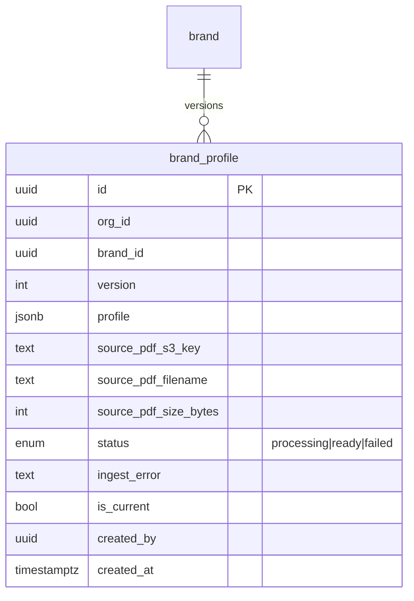
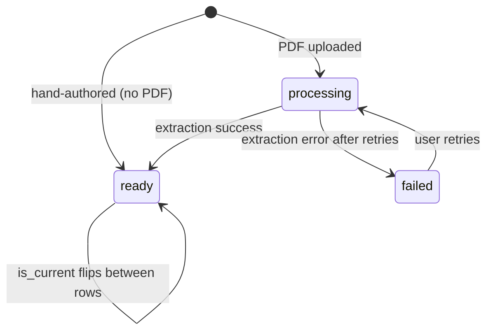
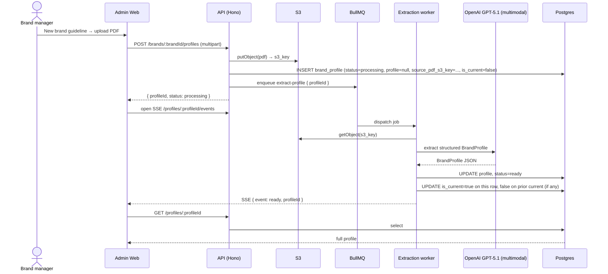
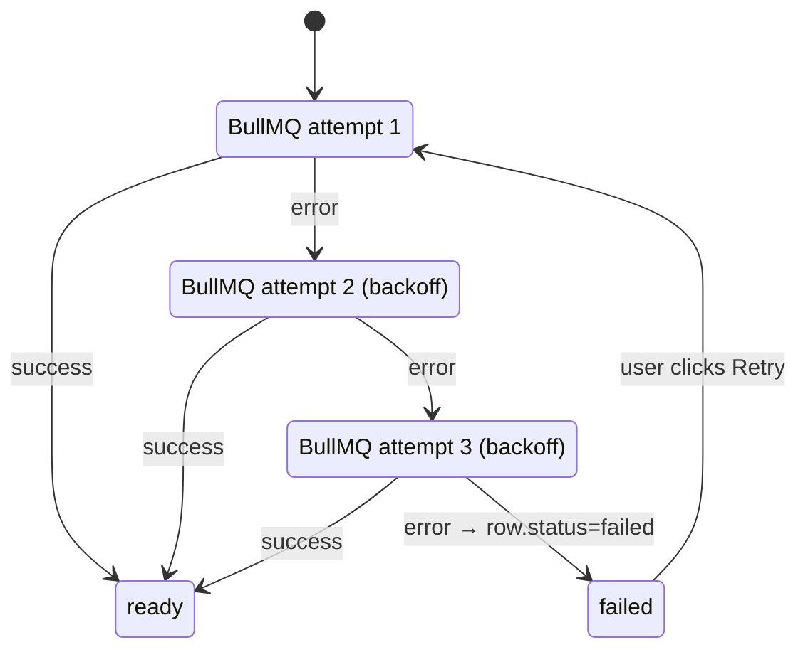

# Brand Guideline Management

The brand-guideline feature lets brand managers ingest, edit, version, and roll back the structured `BrandProfile` for each brand. The profile is the load-bearing artifact every downstream generation feature depends on for brand voice and visual identity.

## Goals

- Take a brand's PDF guideline and turn it into a structured profile suitable for prompt injection.
- Allow hand-authoring a profile when no PDF exists.
- Allow manual edits after extraction (e.g. an admin tweaks a color or fixes a tone descriptor).
- Version every change so any prior state can be restored.
- Notify the user in real-time when a long-running extraction completes.

## Non-goals

- RAG or vector search — replaced by structured extraction.
- Multiple PDFs aggregated into one profile — strictly one PDF per profile version.
- A draft/review/publish workflow — every save is immediately durable, and rollback is a flag flip.

## Actors

- **Brand manager** — uploads PDFs, reviews extracted profiles, makes edits, performs rollbacks.
- **Extraction worker** — async BullMQ worker that runs PDF → `BrandProfile` via OpenAI GPT-5.1 multimodal.
- **System** — admin web UI, API, SSE channel.

## Data model

The feature lives entirely in the `brand_profile` table (see `data-model.md`). Each row is one version. Only one row per brand has `is_current = true` at any time, and only `ready` rows are eligible for `is_current = true`.

## State machine

`is_current = true` is only allowed on `status = ready` rows.

## Flows

### Flow 1 — Create + upload PDF

### Flow 2 — Hand-author (no PDF)

The user clicks "Create blank" and gets an empty profile skeleton to fill in.

- A new `brand_profile` row is inserted with `status = ready`, `profile = <empty skeleton>`, `source_pdf_s3_key = null`, and `is_current = true` (becoming the new current version, displacing any prior current).
- No worker is dispatched.

### Flow 3 — Manual edit save

The user opens the current profile in the admin UI, changes one or more fields (a color, a banned term), and clicks Save.

- One save click = one new version row.
- `INSERT brand_profile` with `version = prior + 1`, `status = ready`, `profile = <updated jsonb>`, `source_pdf_s3_key` copied forward from the prior current row, `is_current = true`.
- The prior current row's `is_current` flips to `false`.

### Flow 4 — Re-upload PDF

The brand manager has a new version of the PDF and uploads it.

- Identical to Flow 1 except `is_current` does **not** flip to the new processing row immediately. The previously ready row stays current until extraction succeeds.
- On extraction success, `is_current` flips to the new row.
- If extraction fails, the new row sits at `failed` status and the prior version stays current.

### Flow 5 — Retry on failure

The user sees a failed row and clicks Retry.

- BullMQ already retries 3× with exponential backoff before declaring a job failed. The user-driven retry is for cases where the job exhausted its retries (for example, a transient model-provider outage that lasted longer than the backoff window).
- The retry marks the row `status = processing` again and re-enqueues the extraction job.

### Flow 6 — Rollback to a prior version

The user opens version history, picks an older `ready` row, and clicks "Set as current".

- Single transaction: flip the prior `is_current = true` row to `false`, flip the chosen older row to `is_current = true`.
- No new row is inserted. Rollback is a pure flag flip.
- Rollback target must be `status = ready`. Rolling back to a `processing` or `failed` row is not allowed.

## SSE channel

The admin web subscribes to `/profiles/:profileId/events` once it has a profile id. The server pushes:

- `ready` when extraction completes successfully.
- `failed` when BullMQ retries are exhausted.

This is the only async UI surface in the feature. Manual edits and rollbacks are synchronous — no SSE needed.

## Integrity rules

- **One current per brand.** Enforced by a partial unique index: `(brand_id) WHERE is_current = true`.
- **`is_current` only on `ready` rows.** Enforced at the application layer; can be additionally enforced via a check constraint or trigger if desired.
- **`profile` is null only when `status` is `processing` or `failed`.** Application-level invariant.

## Open items

- **Concurrent edits.** If two brand managers are editing the same profile simultaneously, the last save wins by version number. Optimistic locking is not implemented in MVP. This is a known limitation.
- **Extraction confidence flags.** The extraction may emit per-field confidence; the UI's review surface for low-confidence fields is not designed in this pass.
- **Diff view.** A "compare versions" UI is desirable but not required for MVP.

## Decisions locked

| Decision | Resolution |
|----------|------------|
| Lifecycle states | None. No draft/published/archived. |
| Versioning trigger | Save click in UI, PDF upload (success), or retry transition. |
| Manual edit granularity | One save click = one new row. |
| `source_pdf_s3_key` on manual-edit row | Copied forward from the prior version. |
| Row creation during extraction | Row exists immediately (`status = processing`), profile null. |
| Retry mechanics | BullMQ 3× w/ exponential backoff; manual retry re-enqueues on the same row. |
| `is_current` during PDF re-upload | Stays on prior `ready` version until new extraction succeeds. |
| Rollback target | Must be a `ready` row. |
| Rollback mechanics | Flip `is_current` flag; no new row inserted. |
