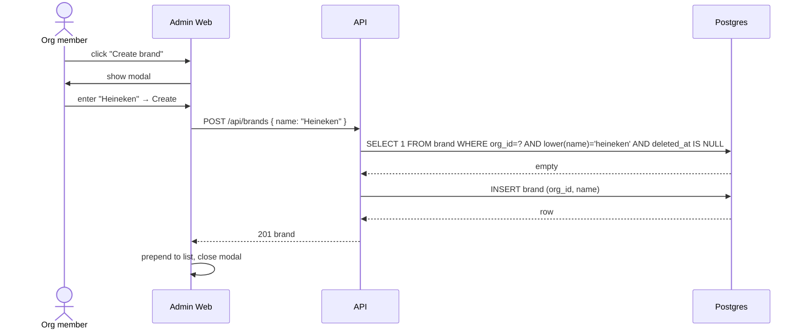

# Brand Management

CRUD over brands within an org. The brand record itself is small — most of the meaningful state for a brand lives in `brand_profile` (designed in `brand-guideline-management.md`). This feature owns the parent record and the surface for picking, creating, and removing brands.

## Goals

- Let any org member create, view, edit, and remove brands.
- Provide the brand list and brand detail pages that host the rest of the brand-related surface (guideline management, generations filtered by brand later).
- Keep the model lean enough that 25 brands fit comfortably in pilot and 100s scale cleanly.

## Non-goals (this design)

- **Roles / permissions.** The assessment requirements do not specify RBAC; MVP treats every authenticated org member as fully privileged.
- **Per-user brand access.** No `user_brand` join table. Every user in the org sees every brand.
- **Hard deletion.** Soft delete only — historical `generation` rows reference `brand_id` and must remain readable.
- **Restore.** Once removed, a brand is gone from the user's perspective. Recovery is a manual DB operation.
- **Search, filtering, sorting.** Deferred.
- **Bulk import / API for client provisioning.** Deferred.
- **Brand metadata beyond `name`.** Slug, description, logo, default locale are all candidates for later passes.

## Actors

- **Org member** — any authenticated user in the org. Creates, edits, removes, opens brands.

## Data model

Already in `data-model.md`. No new columns or tables introduced by this feature.

```
brand
├─ id (uuid pk)
├─ org_id (indexed)
├─ name
├─ deleted_at  — nullable; null = present, set = removed
└─ created_at
```

All reads filter `WHERE deleted_at IS NULL` by default. Removed brands are never surfaced to end users.

Future-candidate columns explicitly **not** added in MVP: `slug`, `description`, `logo_s3_key`, `default_locale`. They can be added later without touching this surface meaningfully.

## API

All endpoints scoped by `org_id` from the session. No role checks.

### `GET /api/brands`

List active (non-removed) brands in the caller's org.

**Response**

```jsonc
{
  "brands": [
    {
      "id": "uuid",
      "name": "Slack",
      "created_at": "2026-04-01T10:00:00Z",
      "current_profile": {
        "id": "uuid",
        "status": "ready",
        "version": 3,
        "updated_at": "2026-04-28T14:22:00Z"
      } /* or null if no profile yet */,
      "generation_count_30d": 142
    }
  ]
}
```

`current_profile` is the row where `is_current = true` for the brand, or null if none. `generation_count_30d` is a cheap aggregate (`count(*) from generation where brand_id=? and created_at > now() - 30d`); fine at pilot scale.

### `POST /api/brands`

Create a new brand.

**Request**

```jsonc
{ "name": "Heineken" }
```

**Response (201)**

```jsonc
{
  "id": "uuid",
  "name": "Heineken",
  "created_at": "...",
  "current_profile": null,
  "generation_count_30d": 0
}
```

Validation: `name` is required, 1–80 chars, unique within `org_id` (case-insensitive) among non-removed brands.

### `GET /api/brands/:id`

Detail view. 404 if `deleted_at` is set.

```jsonc
{
  "id": "uuid",
  "name": "Slack",
  "created_at": "...",
  "current_profile": { /* full pointer; consumer hits brand-guideline endpoints for content */ },
  "profile_history_count": 5,
  "generation_count_30d": 142
}
```

### `PATCH /api/brands/:id`

Edit a brand. Only `name` is editable in MVP. 404 if removed.

**Request**

```jsonc
{ "name": "Slack Inc." }
```

### `DELETE /api/brands/:id`

Soft delete. Hides from the active list and from any brand picker. Historical generations remain readable.

**Behaviour**

- Set `deleted_at = now()`.
- Does not affect existing `brand_profile` rows or `generation` history.
- Idempotent — calling on an already-removed brand returns `404`.
- One-way. No restore endpoint.

**Response (204)** — no body.

### Errors

| Status | Reason |
|--------|--------|
| `400` | Validation (missing/blank name, name too long, etc.) |
| `401` | No session |
| `404` | `brand_id` not in caller's org, or already removed |
| `409` | Duplicate `name` within org on create |

## UI

### `/brands` — list page

```
┌─────────────────────────────────────────────────────────────┐
│  Brands                                  [+ Create brand]   │
│                                                             │
│  ┌─────────────────────────────────────────────────────┐   │
│  │ Slack                                               │   │
│  │ Profile: ready · v3 · updated 4 days ago            │   │
│  │ 142 generations (30d)                       [→]     │   │
│  ├─────────────────────────────────────────────────────┤   │
│  │ Heineken                                            │   │
│  │ Profile: processing · v1                            │   │
│  │ 0 generations                              [→]      │   │
│  ├─────────────────────────────────────────────────────┤   │
│  │ Acme                                                │   │
│  │ Profile: none yet                                   │   │
│  │ 0 generations                              [→]      │   │
│  └─────────────────────────────────────────────────────┘   │
└─────────────────────────────────────────────────────────────┘
```

- Sorted by name.
- Click a row → navigate to `/brands/:id`.
- Profile pill colour: `ready` neutral, `processing` muted, `failed` red, `none yet` muted.
- No filters, no archived view.

### Create brand modal

Triggered from the list. Single name field, validation message, Cancel / Create.

```
┌──────────────────────────────────┐
│  New brand                  [✕] │
│                                  │
│  Name                            │
│  [_______________________]       │
│                                  │
│  ⚠ "Slack" already exists        │
│                                  │
│      [Cancel]  [Create brand]    │
└──────────────────────────────────┘
```

On success, the modal closes and the new brand row appears in the list. The user is then expected to open it and start the brand-guideline flow (covered by `brand-guideline-management.md`).

### `/brands/:id` — detail page

```
┌──────────────────────────────────────────────────────────────┐
│  ← Brands                                                    │
│                                                              │
│  Slack                                  [Edit]   [Remove]    │
│  Created Apr 1, 2026                                         │
│                                                              │
│  ── Brand guideline ──────────────────────                   │
│  Current: v3 · ready · updated 4 days ago                    │
│  History: 5 versions               [Manage guideline →]      │
│                                                              │
│  ── Activity ─────────────────────────────                   │
│  142 generations in the last 30 days                         │
│                              [View generations for Slack →]  │
│                                                              │
└──────────────────────────────────────────────────────────────┘
```

- **Manage guideline** → opens the brand-guideline-management surface (PDF upload, profile editor, version history).
- **View generations** → links to `/generations?brand=<id>` (filter parameter — works once filtering lands per `generations-history.md` open items).
- **Edit** → inline rename or modal.
- **Remove** → confirm dialog → `DELETE /api/brands/:id`.

### Remove confirmation

Dialog text makes the trade-off explicit so the user understands history is preserved but the brand cannot be brought back.

```
┌────────────────────────────────────────────────┐
│  Remove brand "Slack"?                        │
│                                                │
│  Past generations for this brand will still    │
│  appear in history. The brand can not be       │
│  restored from this UI.                        │
│                                                │
│         [Cancel]   [Remove brand]              │
└────────────────────────────────────────────────┘
```

On success, navigate back to `/brands`. The row is gone.

## Brand picker (cross-feature reuse)

The brand picker — used in the plugin and possibly elsewhere — is fed by `GET /api/brands`. No separate endpoint. The picker is owned by the consuming feature, not by brand management.

## Sequence diagrams

### Create



### Remove

```mermaid
sequenceDiagram
    actor U as Org member
    participant A as Admin Web
    participant H as API
    participant D as Postgres

    U->>A: click Remove on brand detail
    A->>U: confirm dialog
    U->>A: confirm
    A->>H: DELETE /api/brands/:id
    H->>D: UPDATE brand SET deleted_at=now() WHERE id=? AND org_id=? AND deleted_at IS NULL
    D-->>H: 1 row
    H-->>A: 204 No Content
    A->>A: navigate to /brands; row is gone
```

## Decisions locked

| Decision | Resolution |
|----------|------------|
| Roles / permissions | None in MVP. Any authenticated org member can do anything. |
| Per-user brand access | None. Org-wide visibility for all brands. |
| Brand metadata | `name` only. Slug, description, logo, default locale deferred. |
| Deletion model | Soft delete via `deleted_at`. UI label is "Remove". No restore. |
| Uniqueness | `name` unique per org, case-insensitive, scoped to non-removed brands. |
| List sort | By name, ascending. |
| Filter / search | None. Removed brands are simply not shown. |
| Brand picker | Same `GET /api/brands` endpoint; no dedicated picker API. |

## Out of scope

- Roles, permissions, per-user brand access
- Brand search, sort options, bulk operations
- Brand logos, slugs, descriptions, default locales
- Hard deletion or merge of brands
- Restore from the UI
- Brand templates / inheritance (brand A based on brand B)
- Org-level settings beyond brands (org name editing, billing, etc.)
