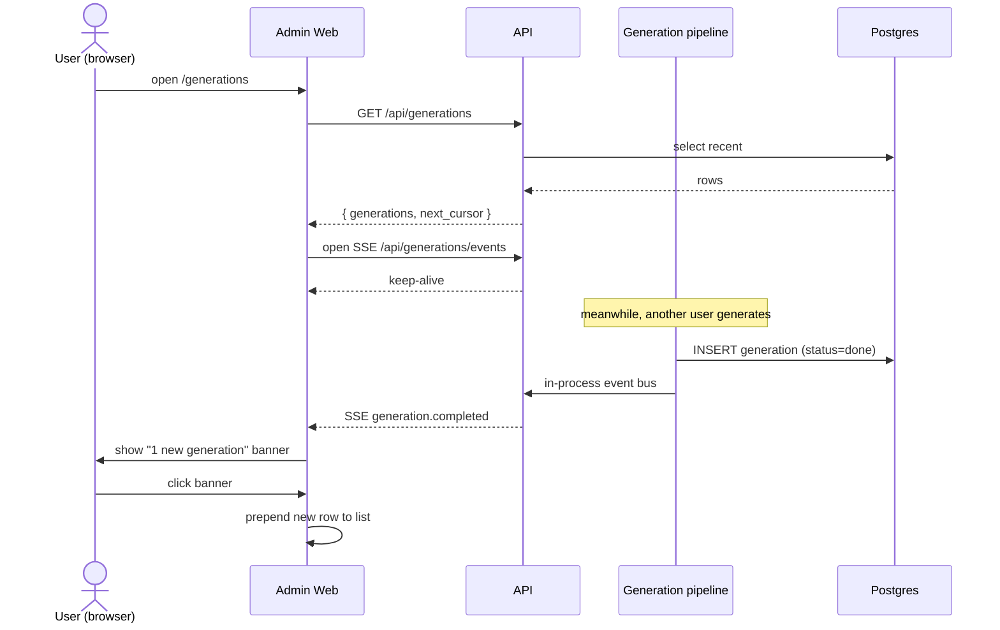

# Generations History

Visibility surface for everything the platform has generated. Lives in the admin web. Reads from `generation` and `usage_event`. Real-time updates via SSE.

## Goals

- Give Creative Ops and brand managers a single place to see what was generated, by whom, for which brand, and at what cost.
- Surface failures and latency outliers.
- Allow audit-style export (CSV).

## Non-goals (this pass)

- Filtering and search — deferred.
- Per-user brand-access restriction — handled in the brand management design pass; queries here will pick up that restriction transparently when it lands.
- Re-run / retry actions on a row — deferred.
- Dashboards beyond simple summary cards — deferred to the broader usage dashboard (B6).

## Actors

- **Creative Ops / brand managers** — the primary readers.
- **Designers** — same UI; same visibility within their accessible brands.
- **System** — pushes SSE events when generations complete.

## Authorization model

Every query is scoped to the caller's `org_id`. Brand restriction (subset of brands a user can see) is layered on once the brand management design lands. Until then, all org users see all org generations.

## Data model

This feature is read-only on the existing tables, with one small addition.

| Table | Why it's needed |
|-------|-----------------|
| `generation` | List rows, detail row |
| `usage_event` | Cost / latency / model rollup per generation |
| `user`, `brand` | Display names |

### Small addition: track the variant the designer applied

`generation.output` is a jsonb array of variants. Add a per-variant `selected: bool` field, populated when the designer picks one in the plugin. Exact mechanism (the PATCH endpoint or push the selected index back) is designed when the plugin design lands. The history detail view assumes the field exists.

```jsonc
// example generation.output for type=copy_variant
[
  { "headline": "...", "subhead": "...", "selected": true  },
  { "headline": "...", "subhead": "...", "selected": false },
  { "headline": "...", "subhead": "...", "selected": false }
]
```

## API

All endpoints are mounted at `/api/generations`. All responses are JSON unless noted.

### `GET /api/generations`

List recent generations, newest first.

**Query params**

| Param | Type | Default | Notes |
|-------|------|---------|-------|
| `cursor` | string | null | Opaque cursor from prior response |
| `limit` | int | 50 | Max 200 |

**Response**

```jsonc
{
  "generations": [
    {
      "id": "uuid",
      "type": "copy_variant" | "translate" | "image",
      "status": "pending" | "running" | "done" | "failed",
      "brand": { "id": "uuid", "name": "Slack" },
      "user": { "id": "uuid", "name": "Jo Osorio" },
      "created_at": "2026-05-02T10:42:11Z",
      "completed_at": "2026-05-02T10:42:12Z",
      "cost_usd": 0.0204,
      "latency_ms": 1120,
      "preview": {
        "input_summary": "5 variants for Summer Sale ad",
        "output_count": 5
      },
      "error": null
    }
  ],
  "next_cursor": "opaque-string-or-null"
}
```

**Notes**

- Server-side query: `select … from generation where org_id = ctx.orgId order by created_at desc, id desc limit :limit (+ cursor)`.
- `cost_usd` and `latency_ms` are aggregates from `usage_event` rows joined by `generation_id`. Computed at query time. (If this becomes hot, add a denormalized `cost_usd_total`, `latency_ms_total` to `generation` later.)
- Cursor is `(created_at, id)` base64-encoded. Stable under inserts (newer rows fall above).

### `GET /api/generations/:id`

Full detail for a single generation.

**Response**

```jsonc
{
  "id": "uuid",
  "type": "copy_variant",
  "status": "done",
  "brand": { "id": "uuid", "name": "Slack" },
  "user": { "id": "uuid", "name": "Jo Osorio", "email": "jo@..." },
  "input": { /* full input jsonb */ },
  "output": [ /* full output array, with selected flags */ ],
  "error": null,
  "started_at": "...",
  "completed_at": "...",
  "created_at": "...",
  "metrics": {
    "cost_usd": 0.0204,
    "latency_ms": 1120,
    "input_tokens": 320,
    "output_tokens": 180,
    "retry_count": 0
  },
  "usage_events": [
    {
      "feature": "copy_variant",
      "provider": "openai",
      "model": "gpt-5.1",
      "input_tokens": 320,
      "output_tokens": 180,
      "cost_usd": 0.0204,
      "latency_ms": 1120,
      "created_at": "..."
    }
  ]
}
```

**Notes**

- 404 if id not in caller's org.
- `retry_count` is computed by counting `usage_event` rows for the same `generation_id` and same `feature` (or by inspecting BullMQ attempts; sourcing TBD when we land the LLM-proxy design).

### `GET /api/generations/export.csv`

Streamed CSV of all generations the caller can see, newest first.

**Query params**

Same as list (`cursor` ignored; full export from oldest to newest in chunks server-side).

**Response**

`Content-Type: text/csv; charset=utf-8`
`Content-Disposition: attachment; filename="generations-YYYY-MM-DD.csv"`

**Columns**

```
id, created_at, completed_at, brand_name, user_email,
type, status, model, locale, cost_usd, latency_ms,
input_tokens, output_tokens, retry_count, error
```

`locale` only populated for `type=translate`.

### `GET /api/generations/events`

SSE channel pushing real-time events as new generations complete in the caller's org.

**Event types**

```
event: generation.completed
data: {
  "id": "uuid",
  "type": "copy_variant",
  "status": "done",
  "brand": { "id": "...", "name": "Slack" },
  "user": { "id": "...", "name": "Jo Osorio" },
  "created_at": "...",
  "cost_usd": 0.02,
  "latency_ms": 1100
}
```

Only emits when the caller's `org_id` matches the generation's `org_id`. Heartbeat every 30s to keep proxies happy.



## UI

The page lives at `/generations` in the admin web.

### Layout

```
┌──────────────────────────────────────────────────────────────┐
│  Generations                                  [Export CSV]   │
│                                                              │
│  ┌─────────┬─────────┬──────────┬─────────────┐              │
│  │ 247     │ $4.20   │ 1.3s     │ 1.2%        │              │
│  │ Total   │ Cost    │ Avg ms   │ Failure %   │  (this week) │
│  └─────────┴─────────┴──────────┴─────────────┘              │
│                                                              │
│  [Today | This week]                                         │
│                                                              │
│  Time     Brand     User    Type      Status   Cost   Latency│
│  ───────────────────────────────────────────────────────────│
│  10:42am  Slack     Jo      copy      done     $0.02  1.1s   │ ← click → drawer
│  10:41am  Heineken  Maya    translate done     $0.01  0.9s   │
│  10:39am  Slack     Jo      image     failed   $0.04   —     │
│  10:35am  Slack     Pat     copy      done     $0.02  1.0s   │
│  …                                                           │
│  [Load more]                                                 │
└──────────────────────────────────────────────────────────────┘
```

### Summary cards

Four metrics, computed for a fixed window (toggle between **Today** and **This week**):

- **Total generations**
- **Total cost (USD)**
- **Avg latency (ms)**
- **Failure rate (%)**

These are queried via a small auxiliary endpoint `GET /api/generations/summary?range=today|week` (will be folded into the broader B6 dashboard design later).

### List

- Newest at top.
- Pagination via "Load more" button at the bottom (cursor under the hood). Infinite scroll deferred.
- Status uses colour: `done` neutral, `failed` red, `running`/`pending` muted.
- Time displayed in user's local timezone, relative ("3m ago") on hover absolute.

### Detail drawer

Slides in from the right when a row is clicked. Contains everything from `GET /api/generations/:id`.

```
┌─────────────────────────────────────────┐
│  Generation #abc123                  [✕]│
│  Slack · copy_variant · done            │
│  by Jo Osorio · May 2 10:42am           │
│                                         │
│  Cost: $0.02   Latency: 1.1s            │
│  Tokens: 320 in / 180 out               │
│  Model: gpt-5.1                         │
│  Retries: 0                             │
│                                         │
│  ── Input ────────────────              │
│  Layers: [headline, subhead, cta]       │
│  Brief: "summer sale, urgent"           │
│  Variants requested: 5                  │
│                                         │
│  ── Output ───────────────              │
│  ► Variant 1  ★ selected                │
│      headline: "Summer's Hot. So Are…"  │
│      subhead:  "50% off everything…"   │
│      cta:      "Shop now"               │
│  ► Variant 2                            │
│      …                                  │
│  ► Variant 3                            │
│      …                                  │
│                                         │
│  ── Usage Events ─────────              │
│  • gpt-5.1 (via openrouter)             │
│    320in / 180out · 1.1s · $0.02        │
└─────────────────────────────────────────┘
```

For `type=image`, the output renders the generated image inline. For `type=translate`, output shows source + translated text per layer.

### Live updates (SSE)

When the user is on the page, the admin web opens an SSE connection to `/api/generations/events`. New events do **not** auto-prepend rows; instead, a toast banner appears at the top:

```
┌──────────────────────────────────────────┐
│  ↑ 3 new generations   [Click to refresh]│
└──────────────────────────────────────────┘
```

Clicking refreshes the list to the top and clears the banner. This avoids surprising the user with shifting content while they're scanning.

If the user closes the page, the SSE connection closes server-side. No persistence of unread state.

### Export CSV

Single button at the top right. Click → browser downloads the CSV streamed from `GET /api/generations/export.csv`. No modal, no progress; the file just lands.

## Performance considerations

- List query is `org_id`-indexed and ordered by `created_at desc, id desc`. Existing index `(org_id, user_id, created_at desc)` is close; add `(org_id, created_at desc, id desc)` if needed.
- Cost/latency aggregation join from `usage_event` per generation row in the list view: at 50 rows per page this is fine. If it becomes hot, denormalize totals onto `generation` at write time.
- SSE channel is one connection per active admin web tab. Pilot scale (10 users) trivial.

## Open items

- Source of truth for `retry_count` — the LLM-proxy design will determine whether to write it onto `generation` directly or compute from `usage_event`.
- The summary card endpoint is shared with B6 dashboard; final shape lands when B6 is designed.
- Per-user brand-access restriction layers in via the brand management design.

## Decisions locked

| Decision | Resolution |
|----------|------------|
| Visibility scope | Org-wide. Brand scoping deferred to brand management design. |
| Filtering / search | Deferred. List is newest-first, no filters in MVP. |
| Detail content | Inputs, outputs (with selected flag), cost, latency, tokens, model, retry count, full usage events list. |
| Track applied output | Yes; `selected: bool` per variant in `output` jsonb. Plugin populates later. |
| Live updates | SSE pushes lightweight events; UI shows banner, user opts in to refresh. |
| Export | CSV only, full export, no filters. |
| Re-run / clone actions | Deferred. |
| Pagination | Cursor-based, "Load more" button. |
