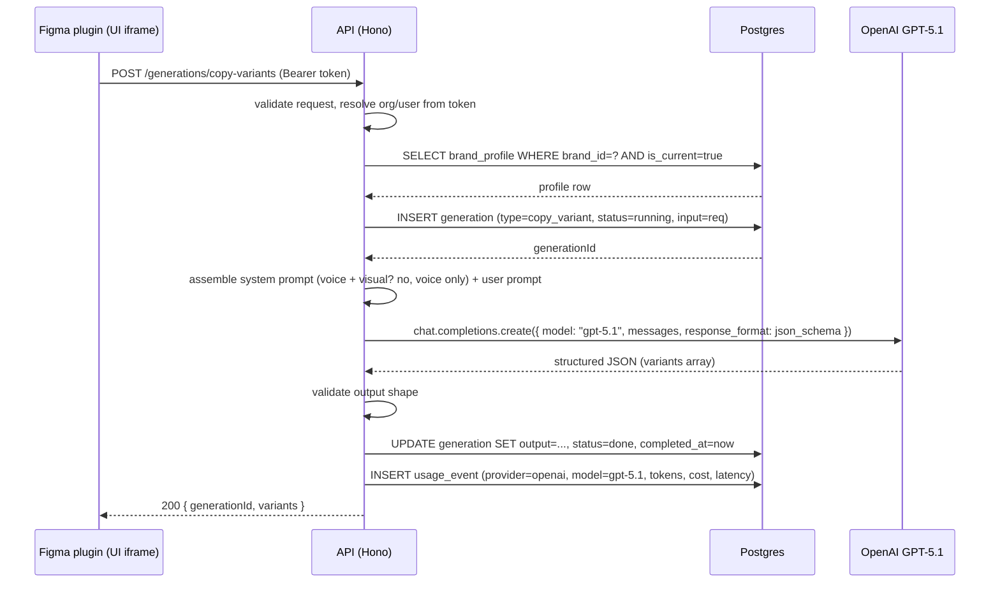

# Text-Layer Generation (Copy Variants + Translation)

Backend design for the two text features the Figma plugin invokes:

- **Copy variants.** `POST /api/generations/copy-variants` — generate N coordinated copy variants across the selected text layers.
- **Translation.** `POST /api/generations/translations` — translate the selected text layers into one target locale, preserving brand voice.

These two features share most of their backend pipeline. They are documented together because the only meaningful differences are the prompt template and the response shape.

## Goals

- Sub-2-second median latency.
- Brand-voice fidelity via the active `brand_profile`.
- Coordinated multi-layer output (a single variant fills the headline, subhead, and CTA together).
- Accept rich layer metadata from the plugin (role hint via `name`, length budget via `charLimit`).

## Non-goals (this design)

- Plugin implementation details — designed in a later pass.
- Image generation — separate design.
- Streaming partial results — sync round-trip is sufficient at the latency budget.
- Multi-locale translations in a single call — plugin loops per locale.

## Why both features share this design

The pipeline is identical except for the system prompt and the response schema:

```
plugin POST → load brand_profile (current) → assemble prompt → call GPT-5.1 via OpenRouter
            → parse structured output → persist generation + usage_event → respond
```

Splitting them into two design docs would duplicate 80% of the content. They diverge only in:

- **System prompt** — copy-variant prompt asks for N variants; translation prompt asks for one rendition in the target locale.
- **Response shape** — copy-variant returns an array of `variants`; translation returns a single `layers` array.

## Actors

- **Figma plugin** — sole consumer of these endpoints. Sends the selected layers and metadata.
- **Backend (Hono API)** — assembles prompts, calls the LLM, persists the generation, returns the result.
- **OpenAI API (GPT-5.1)** — text generation.

## Authorization

Both endpoints require an authenticated session. For the plugin, this is a bearer token in the `Authorization` header. The auth middleware resolves to `(userId, orgId, role)` and scopes everything by `orgId`. The endpoint also validates that `brandId` belongs to the caller's org.

## Locales

The pilot supports a fixed list of 8 ISO codes:

```
en, es, fr, de, it, pt-BR, ja, zh
```

Stored as constants in code (no `locale` table). Per-locale brand voice notes live inside `brand_profile.localization[locale]` and are injected into the translation prompt when present.

## API contracts

### `POST /api/generations/copy-variants`

**Request**

```jsonc
{
  "brandId": "uuid",
  "figmaFileKey": "string",
  "layers": [
    {
      "id": "1:23",
      "name": "Headline",
      "text": "Summer Sale",
      "charLimit": 35
    },
    { "id": "1:24", "name": "Subhead", "text": "Up to 50% off", "charLimit": 80 },
    { "id": "1:25", "name": "CTA",     "text": "Shop now",      "charLimit": 12 }
  ],
  "brief": "summer sale, urgent tone",
  "variantCount": 5
}
```

**Field rules**

| Field | Required | Default | Notes |
|-------|----------|---------|-------|
| `brandId` | yes | — | Must belong to caller's org with a `is_current=true` `brand_profile` |
| `figmaFileKey` | yes | — | Stored on `generation` for traceability; not used by the model |
| `layers` | yes | — | Min 1, max 20 |
| `layers[].id` | yes | — | Stable Figma node id |
| `layers[].name` | no | null | Used as role hint (`"Headline"`, `"CTA"`) |
| `layers[].text` | yes | — | Current text serves as the seed |
| `layers[].charLimit` | no | null | Soft constraint injected into prompt |
| `brief` | no | null | Free-text designer instruction |
| `variantCount` | no | 5 | Min 1, max 10 |

**Response (200)**

```jsonc
{
  "generationId": "uuid",
  "variants": [
    {
      "index": 0,
      "layers": [
        { "id": "1:23", "text": "Summer's Hot. So Are These Deals." },
        { "id": "1:24", "text": "50% off everything until Sunday." },
        { "id": "1:25", "text": "Shop now" }
      ]
    }
    // ... variantCount items
  ]
}
```

### `POST /api/generations/translations`

**Request**

```jsonc
{
  "brandId": "uuid",
  "figmaFileKey": "string",
  "layers": [
    { "id": "1:23", "name": "Headline", "text": "Summer Sale",   "charLimit": 35 },
    { "id": "1:24", "name": "Subhead",  "text": "Up to 50% off", "charLimit": 80 },
    { "id": "1:25", "name": "CTA",      "text": "Shop now",      "charLimit": 12 }
  ],
  "sourceLocale": "en",
  "targetLocale": "es"
}
```

**Field rules**

| Field | Required | Default | Notes |
|-------|----------|---------|-------|
| `brandId`, `figmaFileKey`, `layers[*]` | as above | — | Same shape as copy-variants |
| `sourceLocale` | no | null | If omitted, model auto-detects |
| `targetLocale` | yes | — | Must be one of the 8 supported codes |

**Response (200)**

```jsonc
{
  "generationId": "uuid",
  "targetLocale": "es",
  "layers": [
    { "id": "1:23", "text": "Rebajas de Verano" },
    { "id": "1:24", "text": "Hasta 50% de descuento" },
    { "id": "1:25", "text": "Comprar" }
  ]
}
```

### Errors (both endpoints)

| Status | Reason |
|--------|--------|
| `400` | Validation error — missing fields, unsupported locale, layer count out of range |
| `401` | No / invalid session token |
| `403` | `brandId` does not belong to the caller's org |
| `404` | Brand has no `is_current=true` profile |
| `409` | Brand profile is `processing` or `failed` (no usable profile) |
| `429` | Per-user or org-wide rate limit exceeded (deferred guardrail) |
| `502` | Upstream LLM error after retries |
| `504` | Upstream LLM timed out |

## Pipeline



## Prompt assembly

Two prompts, one shared brand-voice block.

### Shared brand-voice block (rendered from `brand_profile.profile`)

```
You are writing copy for the brand "<Brand Name>".

VOICE:
- Tone: <descriptors as "Confident, never cocky" pairs>
- Personality: <personality_description>
- Do: <do[]>
- Don't: <dont[]>
- Preferred terms: <vocabulary.preferred[]>
- Banned terms: <vocabulary.banned[]>
- Grammar rules: <vocabulary.grammar_rules[]>
- Tone guidance: <tone_explanation>
```

The visual section of `brand_profile` is intentionally omitted from text prompts — colors and typography don't affect copy.

### Copy-variant user prompt

```
The designer has selected the following text layers from a design template.
Generate <variantCount> distinct, coordinated variants. Each variant must
provide one text for every layer below, written in the brand voice.

Brief from the designer: <brief or "(none)">

Layers:
- id=1:23, role="Headline", current="Summer Sale", maxChars=35
- id=1:24, role="Subhead",  current="Up to 50% off", maxChars=80
- id=1:25, role="CTA",      current="Shop now", maxChars=12

Return JSON matching the schema. Do not exceed maxChars per layer.
Within each variant, the layers must work together as one creative idea.
Across variants, take meaningfully different angles.
```

### Translation user prompt

```
Translate the following text layers from <sourceLocale or "(detect)"> into
<targetLocale>. Preserve the brand voice. Match each layer's character limit.
Translation should feel native — not literal.

<if brand_profile.localization[targetLocale] exists>
Locale notes: <localization[targetLocale].notes>
Font sizing notes: <localization[targetLocale].sizing_notes>
</if>

Layers:
- id=1:23, role="Headline", source="Summer Sale", maxChars=35
- id=1:24, role="Subhead",  source="Up to 50% off", maxChars=80
- id=1:25, role="CTA",      source="Shop now", maxChars=12

Return JSON matching the schema.
```

### Structured output

Both prompts use OpenAI's structured outputs (JSON mode with a JSON Schema). Response is validated server-side; if validation fails, retry once with the validation error fed back to the model. After two failures, the request returns `502` and the `generation` row is marked `failed`.

## Persistence

**`generation` row is created at the start** of the request with `status='running'`. On success, it is updated with `output` and `status='done'`. On failure, `status='failed'` and `error` is set.

**`usage_event` rows** capture each LLM call:

- One on success (`feature='copy_variant'` or `'translate'`, `model='gpt-5.1'`, tokens, cost, latency).
- Additional rows for retries (e.g. one for the failed call, one for the successful retry). The history detail view will show all of them.

The `output` jsonb on `generation` matches the response shape exactly. For copy-variants, this is the `variants` array. For translations, it is the per-locale `layers` array. The `selected: bool` flag (per `generations-history.md`) is added by the plugin via a separate PATCH endpoint when the designer accepts a variant.

## Latency budget (≤ 2s p50)

| Phase | Budget |
|-------|--------|
| Auth + validation | ~10 ms |
| Brand profile load | ~10 ms (pk lookup) |
| Generation row insert | ~10 ms |
| Prompt assembly | ~5 ms |
| **OpenAI GPT-5.1 call (single round trip, structured output)** | **~1500 ms p50** |
| Parse + validate output | ~5 ms |
| Generation update + usage_event insert | ~20 ms |
| **Total p50** | **~1.5–1.8 s** |

A single LLM call returning all variants in one structured payload is critical to staying under 2s. A per-variant loop would blow the budget by ~5×.

## Error handling

- **LLM transient errors** (429, 5xx, network) — retry once with 200ms delay. Second failure returns `502`.
- **Schema-validation failure** on model output — retry once with the validator error appended to the prompt. Second failure returns `502`.
- **No `is_current` profile** — return `404`. Plugin should surface "Set up a brand guideline first".
- **Profile `processing` / `failed`** — return `409`. Plugin should surface "Brand guideline isn't ready yet".

## Concurrency / rate limiting

Out of scope for MVP. OpenRouter passes through upstream provider rate limits (OpenAI's per-org caps for GPT-5.1); a future server-side queuing layer in `packages/ai` will add per-tenant caps once usage demands it.

## Decisions locked

| Decision | Resolution |
|----------|------------|
| Backend awareness of "templates" | None. Backend is template-blind. Plugin collects whatever layers the user selected. |
| Layer role source | `node.name` from Figma; null if unnamed. |
| Length budget | Optional `charLimit` per layer, computed by plugin from font size + width. Soft prompt constraint. |
| Variant coherence | Single LLM call returns all variants; each variant fills every layer. |
| Variant count | Default 5, max 10. |
| Brief field | Optional. |
| Translation output | One target locale per call. Plugin loops for multi-locale. |
| Source language | Optional `sourceLocale`; auto-detect by default. |
| Locale list | 8 ISO codes: `en, es, fr, de, it, pt-BR, ja, zh`. |
| LLM | OpenAI GPT-5.1. No provider fallback in MVP. Same-provider retries on transient errors are still in place. |
| Visual brand profile in text prompts | Excluded. Visual data is for image generation only. |
| Selected variant tracking | Out of scope of these endpoints. Plugin sets it via a separate PATCH (designed later). |
| Auth | Bearer token (`Authorization` header). |

## Out of scope

- Plugin implementation
- Image generation
- Real-time streaming of partial output
- Per-locale rate limits, hard spend caps
- Custom per-locale models (e.g. routing CJK to a stronger model if one beats GPT-5.1 on those scripts)
