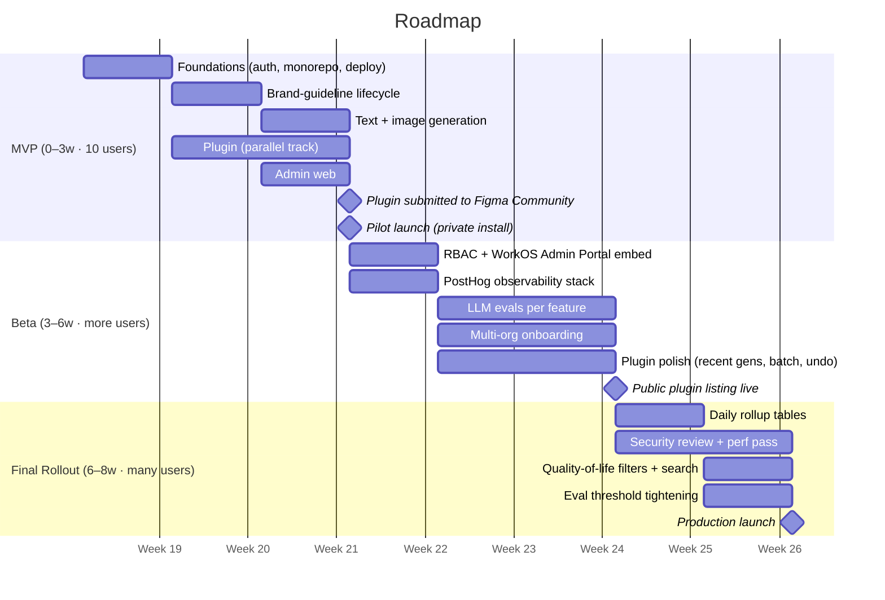

# Phased Roadmap

Eight weeks target, ten-week ceiling. Three phases mapped to user scale, not build activity. The full architecture lands inside the budget — full observability, LLM evals per feature, RBAC via WorkOS, public plugin distribution. Two senior full-stack engineers paired with AI coding agents.

## Overview

| Phase | Window | Audience | Goal |
|-------|--------|----------|------|
| **MVP** | Weeks 0–3 | 10 users (DesignTechCo Creative Studio) | Internal pilot. Four user-facing actions wired end to end. Single tenant. Plugin built, submitted to Figma Community at end of week 3. |
| **Beta** | Weeks 3–6 | More users — 1 to 2 additional client orgs | Multi-tenant onboarding, RBAC enforcement, full observability stack, eval discipline per feature. Plugin live publicly via Figma Community. |
| **Final Rollout** | Weeks 6–8 | Many users — production launch posture | Security review, performance pass, daily rollup tables for analytics scale, quality-of-life filters, on-call defined. |

Two-week buffer to the 10-week ceiling preserved for Figma plugin review queue or unexpected integration issues.

## Phase 1 — MVP (Weeks 0–3)

10 users, one tenant: the DesignTechCo Creative Studio.

### What ships

**Backend (week 0–1):**
- Hono API with router · validator · service · repository per entity. Drizzle on Postgres. Redis for BullMQ. S3 for assets. WorkOS auth integration. SSE bridge for async job completion.
- Pino structured logs. Docker for local + production.

**Brand-guideline lifecycle (week 1–2):**
- Upload PDF, multimodal extraction worker, structured `BrandProfile` JSON, manual edits, version history, rollback as a flag flip.
- Mandatory human review before any extracted profile becomes current.

**Generation paths (week 2):**
- Sync text + translation: single OpenAI round-trip with structured output, ≤2s p50.
- Async image generation: BullMQ job, worker calls `gpt-image-2`, S3 upload, Redis pub/sub completion event, SSE forward to client.

**Admin web (week 2–3):**
- Brand management (CRUD + soft delete).
- Brand-guideline editor (the lifecycle UI).
- Generations history (list + detail + live SSE updates).
- Per-user usage dashboard (sums from `usage_event`, daily cost chart, by-user table).
- WorkOS Admin Portal embed for org user management.

**Figma plugin (week 1–3, parallel track):**
- Manifest with domain whitelist for our API and S3 bucket.
- Two-thread runtime: main thread reads/writes Figma layers via `figma` global; UI iframe handles network and SSE.
- OAuth flow inside the iframe, token in `figma.clientStorage`.
- Brand picker pulls from `/api/brands`.
- Three action panels: Copy variants · Translate · Image (text-to-image and image-to-image, three variants).
- Apply variant: text via `node.characters = ...`, image via `figma.createImageAsync(signedUrl)`.
- **Submitted to Figma Community at end of week 3.** DesignTechCo runs on a private install during the 5–10 business-day review.

**Models — OpenAI only at MVP.** GPT-5.1 (text + translation + multimodal PDF extraction), gpt-image-2 (image). One vendor, one key, one billing surface, one rate-limit pool ships fastest. The LLM proxy abstracts every call site so Beta can light up multi-provider without a rewrite.

### Exit criteria

- All 10 designers signed in, using the plugin at least weekly.
- A previously 3-day localisation completes inside the plugin in **under 5 minutes** end to end.
- Per-user cost attribution accurate to ±5% of upstream provider invoices.
- 99% availability against managed-service SLAs.

### Risks + mitigations

| Risk | Likelihood | Impact | Mitigation |
|------|-----------|--------|------------|
| Brand-guideline extraction garbage on narrow PDFs (Heineken-style design-only books) | Medium | High | Mandatory human review before publish. Hand-author fallback for sparse profiles. Rollback as a flag flip. |
| Figma plugin two-thread runtime adds week of integration debugging | Medium | High | Architecture pattern documented in `research/figma-plugin.md`. Reference Figma sample plugins. AI agents help with boilerplate; integration debugging stays human. Build plugin in week 1, not week 3, so issues surface early. |
| WorkOS OAuth + plugin iframe edge cases (callback origin handling, token refresh) | Medium | Medium | Pattern documented in research notes. Use WorkOS sealed sessions to avoid JWT minting overhead. Test silent re-auth flow before week 3. |
| OpenAI rate-limit hit during pilot | Low (10 users) | Medium | Single org well below quota. Same-provider retries handle bursts. |
| ≤2s text-gen budget blown under load | Low | High | Single OpenAI round-trip. Structured-output JSON returns N variants at once. No chained calls. |
| Plugin closes mid-image-gen, designer thinks job failed | Medium | Low | Worker completes regardless. Result visible in admin web history. Recent-generations panel inside plugin lands in Beta. |
| Pilot scope creep | High | High | Anything outside "what ships" lands in Beta backlog. No exceptions. |

## Phase 2 — Beta (Weeks 3–6)

Add access controls, observability, evals, multi-tenant onboarding, multi-provider routing. Bring 1–2 additional client orgs online. Public plugin listing goes live during this phase.

### What ships

**Feedback loop from MVP pilot (week 3, ongoing):**
- DesignTechCo Creative Studio sends weekly written feedback. Top items by frequency move to the front of the Beta backlog.
- PostHog session replays + product analytics + LLM trace data inform which surfaces are friction.
- Per-feature eval thresholds calibrated against MVP run data.

**Multi-provider routing via the LLM proxy (week 3–4):**
- All MVP call sites already go through `packages/ai`. Beta lights up cross-provider config without touching call sites.
- **Anthropic Claude** added as fallback or per-feature pick for text generation and translation.
- **fal.ai** added as fallback or per-feature pick for image generation.
- Routing controlled per-feature via PostHog feature flags. Fallback triggers on transient OpenAI errors after the same-provider retry budget is exhausted.
- No vendor lock-in beyond the SDK abstraction; same prompt assembly, same structured-output contract.

**RBAC (week 3–4):**
- Three roles defined in the WorkOS dashboard: `admin`, `brand_manager`, `designer`. Role flows into the session and onto `user.role`, mirrored locally.
- Per-brand access via a `user_brand` mapping table in our Postgres. Designers see only the brands they're assigned to.
- Every router scope-checks `(org_id, user_id, role, brand_id)` before any read or write.
- Role assignment surface in the admin web, backed by WorkOS Admin Portal widgets.

**Observability (week 3–4):**
- PostHog as the single observability platform. Wire-up across API, worker, admin web, and plugin.
- Captured: errors with grouping and alerts, session replay (admin web), feature flags (staged RBAC enforcement, brand-profile schema migrations), product analytics, surveys for pilot feedback, LLM observability (every model call traced: prompt, brand-profile context, tokens, output, latency, cost).
- One vendor for everything off the application data path.

**Evaluations per feature (week 4–6):**
- Eval suite is feature-scoped, not brand-scoped. Brand profile is the input parameter varied during runs.
- **Text-gen eval:** prompt fixtures across multiple voice/tone profiles. LLM-as-judge for tone match. Char-limit adherence checked deterministically.
- **Translation eval:** source-locale × target-locale pairs across all 8 locales. LLM-as-judge for fluency and tone preservation. Length constraint check.
- **Image-gen eval:** prompt fixtures with brand profiles attached. CLIP-style similarity for style adherence. Brand-color presence check (deterministic, hex-distance based). Banned-element detection.
- **PDF extraction eval:** known-good fixture PDFs with hand-authored target profiles. Diff against extracted profile.
- Runs nightly. Regressions surface in the admin web; brand managers see which feature × which profile failed.

**Multi-tenant onboarding (week 4–5):**
- WorkOS Admin Portal flow for self-serve org creation.
- Org logo, display name, default locale per tenant.
- Org switcher in admin web.
- Tenant-scoped brand isolation enforced by the RBAC middleware.

**Plugin polish (week 4–6):**
- Recent-generations panel inside the plugin (deferred from MVP).
- Batch operations across multiple selected layers in one click.
- Undo of an applied variant.
- **Public Community listing goes live mid-Beta.** Existing tenants seamlessly migrate from private install or stay where they are.

**Reliability (week 5–6):**
- Soft alerts before usage caps trigger.
- Same-provider retry-with-circuit-breaker on the LLM proxy.
- PostHog uptime checks for the API.
- CDN in front of S3 (CloudFront or equivalent), one config change.

### Exit criteria

- 2–3 additional client orgs onboarded without manual engineering intervention.
- Public plugin listing live in Figma Community.
- 99.5% availability on a 30-day rolling window.
- p95 image-gen end-to-end under 20s.
- RBAC audited: zero cross-tenant or cross-brand reads in the adversarial test suite.
- Eval suite green for every brand-profile publish in the last 14 days.

### Risks + mitigations

| Risk | Likelihood | Impact | Mitigation |
|------|-----------|--------|------------|
| Cross-tenant or cross-brand data leak under concurrent load | Low | Critical | Automated suite asserts every endpoint scopes by `org_id` and `user_brand`. Partial unique indexes as a backstop. RBAC test fixtures cover every role × every endpoint × every owned-vs-foreign brand. |
| Figma Community plugin review exceeds the 10 business-day target | Medium | Medium | Plugin submitted at end of MVP (week 3). Beta tenants stay on private install through the review window. Public listing is additive, not blocking. |
| WorkOS Roles primitive too coarse for RBAC needs | Low | Medium | Three roles are intentional: WorkOS handles role assignment (the coarse axis); our `user_brand` mapping handles per-resource scope (the fine axis). Hybrid pattern is standard across SaaS. |
| OpenAI sustained throttling at 3-org scale | Medium | Medium | Same-provider retries with circuit breaker. Multi-provider routing in the LLM proxy lights up in Beta — Claude and fal.ai as fallback. Quota-utilisation alerts via PostHog. Per-tenant caps remain a future option if needed; not in scope. |
| Cross-provider parity drift (Claude / fal.ai outputs differ from OpenAI on the same prompt) | Medium | Medium | Eval suite runs per-provider. Brand-tone judge scores compared across providers; provider choice per feature gated on eval parity. Safe default stays OpenAI; fallback only triggers on transient errors. |
| Eval false positives blocking publishes | Medium | Medium | Per-feature thresholds (not global). Permissive thresholds at week 4, tightened with run data through week 6. Audited manual override available to brand managers. |

## Phase 3 — Final Rollout (Weeks 6–8)

Two weeks. Production launch posture. Security signed off, performance verified, analytics rollup tables live, on-call defined, quality-of-life features for daily users.

### What ships

**Feedback loop from Beta tenants (week 6, ongoing):**
- Top items from multi-tenant usage land first. Beta surfaced what real cross-org access patterns and onboarding friction look like.
- Eval threshold tightening uses Beta-run data, not synthetic fixtures.
- QoL prioritisation driven by user-feedback frequency, not engineering preference.

**Analytics scaling decision (week 6, gated on Beta metrics):**

We do not pre-commit to a rollup pipeline. We measure first, then pick.

Audit Beta-period numbers at week 6 day 1:
- Daily `usage_event` volume (raw rows/day, peak vs. average).
- Dashboard p95 latency on raw queries with no rollup.
- 3-week growth rate from Beta usage curve.

Decision tree:
- **Volume < 50k/day, p95 < 200ms on raw → skip rollups entirely.** Postgres direct queries handle the next 6 months. Revisit at month 3.
- **Volume 50k–500k/day, p95 200ms–1s → build daily rollups.** `usage_daily` table: one row per `(org_id, user_id, brand_id, feature, date)` with aggregates (call count, cost sum, latency p50/p95). Refreshed nightly via `MATERIALIZED VIEW REFRESH CONCURRENTLY` or a scheduled cron. Dashboard reads rollups for trend lines; drill-downs continue to read `usage_event` directly.
- **Volume > 500k/day sustained, or p95 > 1s on rollups, or customer-facing analytics enters scope → ClickHouse migration into Final Rollout backlog.** Rollups would be band-aid at that volume; commit to columnar storage.

What ships in week 6–8 depends on which branch the audit picks. The 2-week buffer to the 10-week ceiling exists for the migration branch.

**Security review (week 6–7):**
- Pen-test the auth + brand boundary. RBAC adversarial tests: every role × every endpoint × every owned-vs-foreign resource.
- WorkOS Admin Portal hardening review.
- Token rotation cadence locked. Plugin manifest domain whitelist final review.
- OAuth app registration with Figma (required since November 2025 for any app touching the Figma REST API).

**Performance pass (week 6–7):**
- p95 budgets verified for every action.
- Postgres index review + analyze.
- SSE connection ceiling tested.
- Worker autoscale rules.

**Quality-of-life features (week 7–8):**
- Generations history filters: by user, by brand, by type, by status, by date range.
- Search across history (text query against `input`/`output` jsonb).
- Usage dashboard breakdowns: by feature, by model, by locale.
- Plugin recent-generations panel polish — sorting, filter by file.

**Eval suite stabilization (week 7–8):**
- Tighten thresholds with real-run data accumulated during Beta.
- Failing prompts auto-routed to brand managers for profile-edit suggestions.
- Regression dashboard public to brand managers.

**Operability (week 7–8):**
- Runbook per failure mode (OpenAI 5xx, Redis disconnect, S3 throttle, WorkOS outage, Figma plugin distribution issue).
- PostHog alert routing finalized.
- On-call rotation defined for the 2-engineer team.

### Exit criteria

- Customer onboarding (new org → first generation) completes in under 1 day with zero engineering involvement.
- Eval regression rate under 5% per brand-profile publish.
- Security review sign-off with no P0/P1 findings unaddressed.
- Analytics scaling decision committed (skip / rollups / ClickHouse) with Beta-metric evidence behind it. Whichever branch was picked, the dashboard is queryable under p95 budget.
- On-call rotation in place; runbook validated against at least one synthetic incident.

### Risks + mitigations

| Risk | Likelihood | Impact | Mitigation |
|------|-----------|--------|------------|
| Public plugin review still pending past week 8 | Low | Medium | Beta tenants and pilot stay on private install. Public listing arrival post-launch is acceptable; not on the critical path. |
| Two-week window too tight for security review + perf pass + QoL | Medium | Medium | Security review starts at week 6 day 1. QoL features prioritized by user-feedback frequency from Beta. Some QoL items are post-launch acceptable. |
| Two-week buffer to ceiling consumed by Figma review delay | Medium | Medium | The 10-week ceiling exists for exactly this. Phase 3 deliverables not blocked by plugin review status. |
| Daily rollup pipeline lag invalidates dashboard freshness (only if rollup branch picked) | Low | Low | Rollup is nightly-refreshed; staleness bounded by 24h. Drill-down to raw `usage_event` always available for fresh queries. |
| Analytics audit at week 6 surprises us with Beta-volume numbers requiring ClickHouse migration | Medium | Medium | The 2-week buffer to the 10-week ceiling exists for exactly this. ClickHouse migration with `usage_event` mirror via batch export is documented and scoped. Postgres remains source of truth for OLTP. |

## Cumulative timeline

The Gantt is illustrative — exact week boundaries depend on velocity discovered during MVP. The phase ordering and exit-criteria gates are the load-bearing parts of the plan.

## Cross-cutting risks (apply at every phase)

| Risk | Mitigation |
|------|------------|
| LLM hallucination producing off-brand or harmful copy | Brand-profile constraints, banned-terms list, structured-output validation, every generation reviewed by the designer before applied. Eval suite catches regressions across releases. |
| Customer trust in extraction quality | Mandatory human review at brand-profile publish. Rollback always available. PostHog LLM trace per extraction visible to brand managers. |
| Two-engineer capacity (with AI coding agents) | Scope discipline (this roadmap). No new tooling adoption mid-phase. Lean on managed services. AI agents accelerate boilerplate and tests; integration-heavy work (plugin SDK quirks, OAuth edge cases, observability tuning) stays human-driven. |
| Cost projections wrong | `usage_event` per call gives accurate forecasting from week 1. PostHog LLM cost dashboards from week 4. |
| OpenAI availability dropping below committed SLA | MVP: same-provider retry-with-backoff, single-vendor dependency. Beta: cross-provider fallback live in the LLM proxy — Claude for text, fal.ai for image, fallback or per-feature pick. The AI-SDK abstraction makes the upgrade a config change, not a rewrite. |

## Figma plugin: special-case risk surface

The plugin is the only piece of the architecture distributed through a third-party review process. Worth its own section.

| Concern | What we know | Plan |
|---------|--------------|------|
| Build complexity | Two-thread runtime (main + UI iframe), async-only `clientStorage`, no fetch on main thread, plugin termination on close. Documented in `research/figma-plugin.md`. | Architecture chosen against these constraints. SSE for async, bearer-token auth in iframe + clientStorage for token, `figma.createImageAsync` for fills. Plugin work starts week 1 in parallel with backend, finishes by week 3. |
| Private distribution (MVP bridge) | Org / Enterprise plans can distribute privately. **No Figma review.** | DesignTechCo installs from their org during the public-review window. |
| Public Community listing | Required for unrestricted public install. **5–10 business days target review window.** Forum reports show occasional longer queues. Security disclosure form review can extend up to 2 weeks. | Submitted day one of Beta (week 3 end). Existing tenants stay on private install during the review. Public listing is additive. |
| Figma REST API + OAuth app review | Since November 2025, OAuth apps using REST API need review even for private use. Public listing also reviewed. | Register the OAuth app in the Figma developer portal during MVP. Submit for review at end of MVP alongside the plugin. |
| Plugin manifest domain whitelist | Single fixed API domain baked into manifest. No dynamic per-tenant hostnames. | Multi-tenant resolves from the auth token, not from URL. Pattern fits architecture by design. |
| Frozen plugin / multiplayer edits | Plugin docs flag edge cases (deleted nodes mid-operation, concurrent multiplayer changes). | Tested during MVP week 3. Defensive defaults: re-resolve node by ID before write, error gracefully if node is gone. |

## What gets built when (one-line summary)

- **MVP** = foundations + lifecycle + sync/async generation + admin web + plugin built and submitted, behind WorkOS auth and Admin Portal embed, single tenant. **OpenAI only.**
- **Beta** = MVP-pilot feedback + multi-provider routing (Claude + fal.ai) + RBAC (WorkOS Roles + `user_brand` Postgres mapping) + WorkOS Admin Portal widget for tenant team management + PostHog full stack + per-feature evals + multi-org onboarding + plugin live publicly.
- **Final Rollout** = Beta-tenant feedback + analytics scaling decision (skip rollups / build rollups / migrate to ClickHouse, gated on Beta metrics) + security signed off + performance verified + QoL filters/search + on-call defined.
